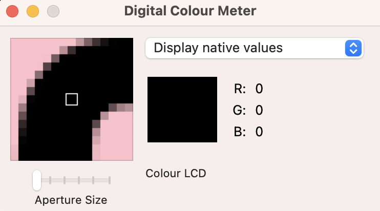
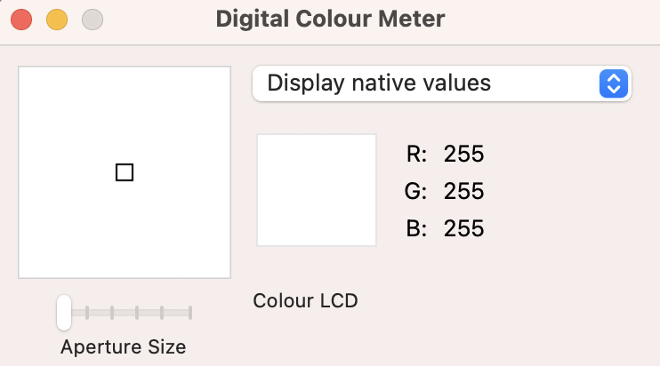
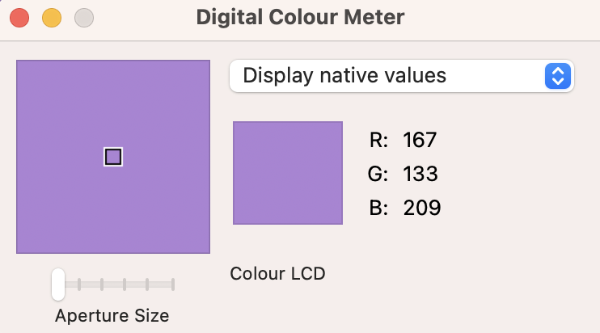
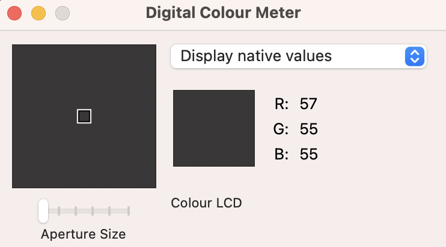

Cheers Quiz


## About
Cheers Quiz is a website that allows users to learn or polish their language skills. This quiz will be targeted to anyone who wants to be able to have a toast with 10 different nationalities by saying "Cheers".

The site can be accessed by this [link](https://bianca9901.github.io/spanish-quiz/)


---

## User Stories

### **First-Time Visitor Goals:**

* As a first-time visitor my goal is to find out what this website is about so that I can learn more.

* As a first-time visitor my goal is to know what my current score is so that I know my level. Therefore I take this quiz.


### **Returning Visitor Goals:**

* As a returning visitor my goal is to repeat the phrases so that I can see if I can get a better score

* As a returning visitor my goal is to find the Cheers-Quiz’s social media so that I can follow and interact with them.

* As a returning visitor my goal is to contact the quiz authors so that I can ask further questions or suggest an improvement.

### **Frequent Visitor Goals:**

* As a frequent visitor my goal is to get a full score so that I know that I memorized all the phrases.


## Existing features

### Home page consists of
* The Logo,
* A description of the quiz.
* The Quiz
* The Footer


### The Logo
Bild

### A description of the Quiz
Bild


#### The Quiz
1. The quiz section displays a button with the text ‘’start’’ that when pressed will display the first question.

2. When the first question is displayed, the start question gets removed and the user will be presented with question 1 with the following 4 alternative answers where only one is correct. 

3. When the user has chosen their answer a color of green will be displayed if it was guessed correctly, and a colour of red will be displayed if guessed wrong. 

4. The user then has the option to click the button ‘’next’’. If clicked, question number 2 and the following 4 alternatives will be displayed. This time the user will have two options, to select the ‘’next’’ button or the‘’restart’’ button. 

5. If the visitor finishes all questions, their score will be displayed. The visitor gets 1 point for every correct answer with a maximum score of 10.

6. The score will display the text "You can say cheers in x/10 languages!"


#### The Footer
Has social media icons that when pressed will open up in a new tab. It also has a general email for the quiz authors.

---

## Features Left to Implement

* Make the answers get shuffled if the user wants to restart the game

* A favicon

* A custom 404 page

---

## Technologies used

* [HTML](https://developer.mozilla.org/en-US/docs/Web/HTML)
was used for structuring the website.
* [CSS](https://developer.mozilla.org/en-US/docs/Web/CSS)
was used to style the website.
[Flexbox](https://developer.mozilla.org/en-US/docs/Learn/CSS/CSS_layout/Flexbox) was used to get the layout and to get the site responsive on different devices.
[Grid](https://developer.mozilla.org/en-US/docs/Web/CSS/CSS_grid_layout) was used to get the layout and to get the site responsive on different devices.
* [Balsamiq](https://balsamiq.com/)
was used to make the wireframe.
* [Github](https://github.com/)
was used to host the code on the website.
* [Git](https://git-scm.com/)
was used for version control.
* [Visual studio code](https://code.visualstudio.com/)
was used to write the code.
* [JavaScript] (https://developer.mozilla.org/en-US/docs/Web/JavaScript) was used to make the quiz.

---

## Design

### Colors

Black, White, Pink, Purple and Grey. 








### Typography 

I used [Google Fonts](https://fonts.google.com/) for all text. The name of the font is Bebas Neue Regular 400.


### Wireframes

#### I used [Balsamiq Wireframes](https://balsamiq.com/wireframes/) to make a mockup sketch of the layout before starting to code.


---

## Testing

### Validator testing

#### No errors were returned when passing through the official [W3C validator](https://validator.w3.org/) for the html. No errors were found when passing through the official [Jigsaw](https://jigsaw.w3.org/css-validator/validator.html.en) validator for CSS.

#### HTML
* Homepage 


* Contact-us page


* Response page


#### CSS


---

## Accessibility and performance scores
I used [lighthouse](https://developer.chrome.com/docs/lighthouse/overview/) to get approval that the site is performing well and that it is accessible.

* Home page


* Contact us page 

* Response page 

---

### Manual testing

## Bugs

### Solved bugs


### Unsolved bugs

### Mistakes


--- 

## Deployment

The site was deployed to GitHub pages.
* The steps to deploy are as follows:

* In the GitHub repository, navigate to the Settings tab
From the source section drop-down menu, select the Main Branch

* Once the main branch has been selected, the page will be automatically refreshed with a detailed ribbon display to indicate the successful deployment.

## Local deployment
How to make a local clone of this project.

1. Copy this url https://github.com/bianca9901/zen-zone.git
2. Open terminal.
3. Type ```git clone``` and paste the url.
4. Press enter to create your local clone.

---

## Future improvements

---

## Credits

### Content
The icons in the footer and logo were taken from [Font Awesome](https://fontawesome.com/)

To make the code for the box-shadow I used [Css Matic](https://www.cssmatic.com/box-shadow)

I used [Digital Colour Meter](https://support.apple.com/sv-se/guide/digital-color-meter/welcome/mac) for the screenshot of the colors in my website that I demonstrated in this README.md 

---