# Cheers Quiz

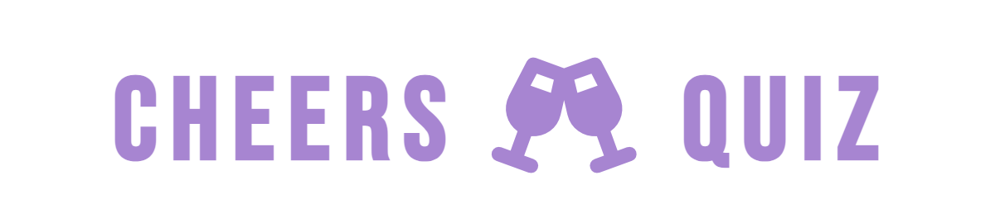

## About
Cheers Quiz is a website that allows users to learn or polish their language skills. This quiz is for anyone who wants to be able to have a toast in 10 different languages by saying "Cheers".

The site can be accessed by this [link](https://bianca9901.github.io/cheers-quiz/)


---

## User Stories

### **First-Time Visitor Goals:**

* As a first-time visitor my goal is to explore the Cheers Quiz website and understand its purpose and features.

* As a first-time visitor my goal is to do the quiz so that I can test my current language knowledge.


### **Returning Visitor Goals:**

* As a returning visitor my goal is to repeat the phrases so that I can see if I can get a better score.

* As a frequent visitor my goal is to find the Cheers-Quiz’s social media so that I can follow and interact with them.


### **Frequent Visitor Goals:**

* As a frequent visitor my goal is to get a full score so that I know that I memorized all the phrases.

* As a returning visitor my goal is to contact the quiz authors on social media so that I can ask further questions or suggest an improvement.


## Existing features

### Home page consists of
* A Logo
* A Quiz
* A Footer

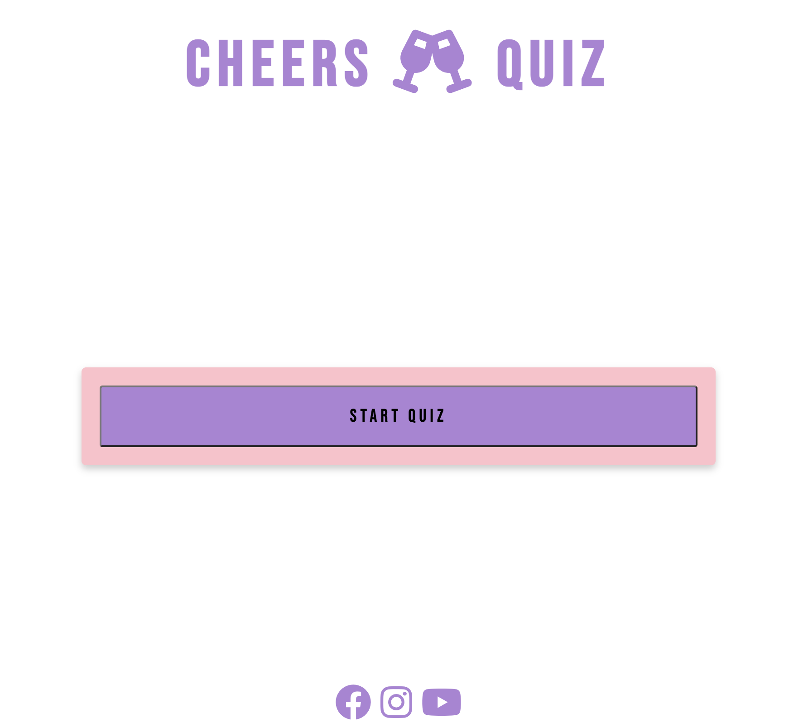

#### The Logo


#### The Quiz
1. The quiz section begins with a "Start" button. Upon clicking it, the first question and following 4 answer alternatives is displayed out of which only one is correct.

2. Once the user chooses an answer, the selected option is highlighted in green if correct or red if incorrect.

3. If the user selects the correct answer, the score updates by 1, displayed as "Score: 1" at the bottom of the quiz-box.

4. The user can then proceed by clicking the "Next" button. This action reveals question number 2 and its corresponding four alternatives.

5. Once the user completes all the questions, their score is shown as "You can say cheers in x out of 10 languages!"

6. At this point, the "Next" button is hidden, and a restart button appears beneath the score text for the user to replay the quiz
 
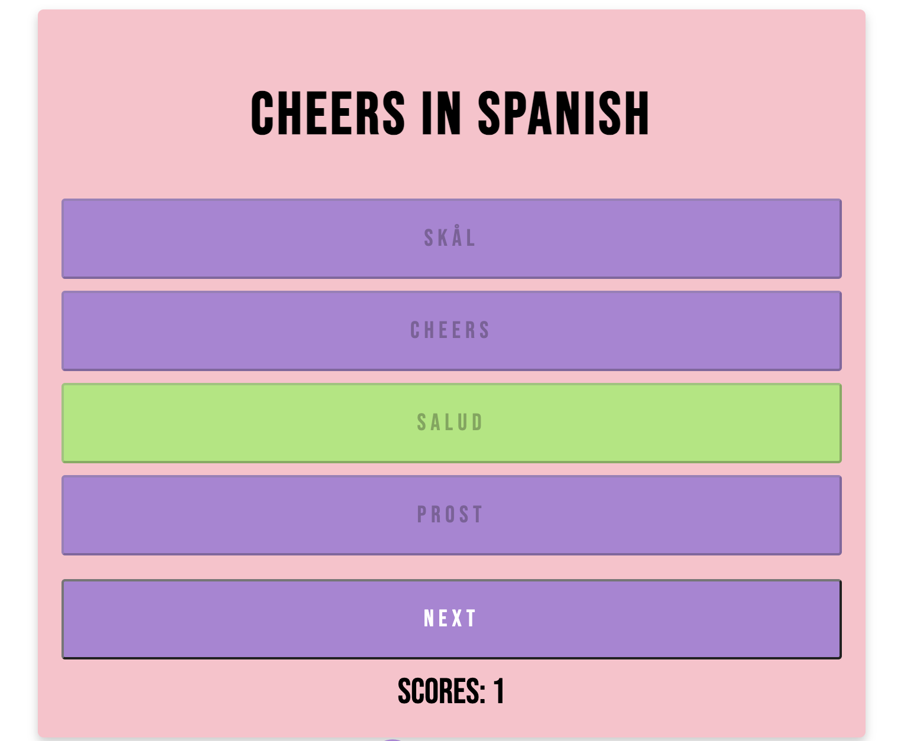
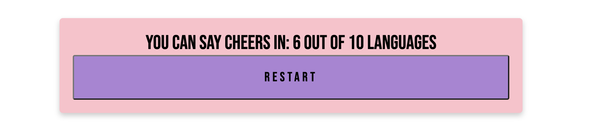

#### The Footer
Has social media icons that when pressed will open up in a new tab.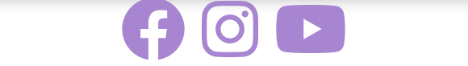

---

## Features left to Implement

* Shuffle questions and answers if the user wants to restart the game.

* A favicon

* A custom 404 page

---

## Technologies used

* [HTML](https://developer.mozilla.org/en-US/docs/Web/HTML)
was used for structuring the website.
* [CSS](https://developer.mozilla.org/en-US/docs/Web/CSS)
was used to style the website.
* [Flexbox](https://developer.mozilla.org/en-US/docs/Learn/CSS/CSS_layout/Flexbox) was used to get the layout and to get the site responsive on different devices.
* [Grid](https://developer.mozilla.org/en-US/docs/Web/CSS/CSS_grid_layout) was used to get the layout and to get the site responsive on different devices.
* [Balsamiq](https://balsamiq.com/)
was used to make the wireframe.
* [Github](https://github.com/)
was used to host the code on the website.
* [Git](https://git-scm.com/)
was used for version control.
* [Visual studio code](https://code.visualstudio.com/)
was used to write the code.
* [JavaScript](https://developer.mozilla.org/en-US/docs/Web/JavaScript) was used to make the quiz.

---

## Design

### Colors

The main colors used for the design was,
Black, White, Pink and Purple. 

RGB (0,0,0)
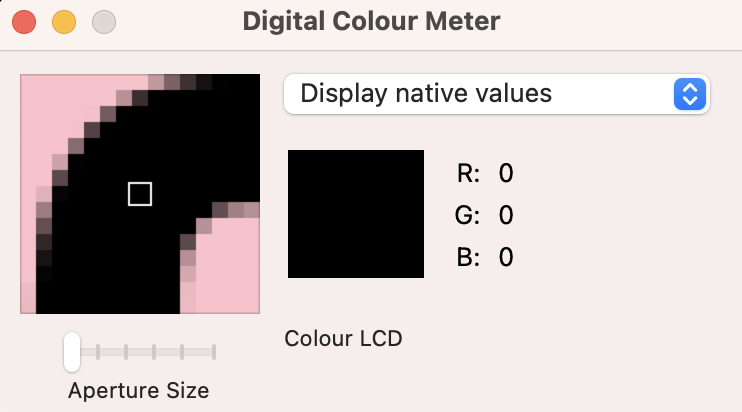

RGB (255,255,255)
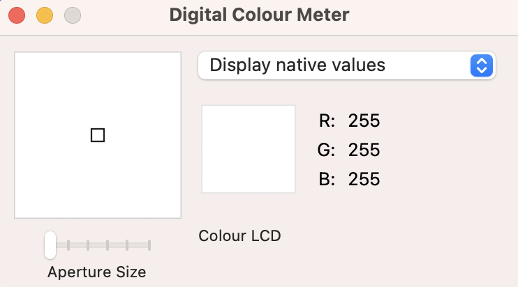

RGB (245,195,203)
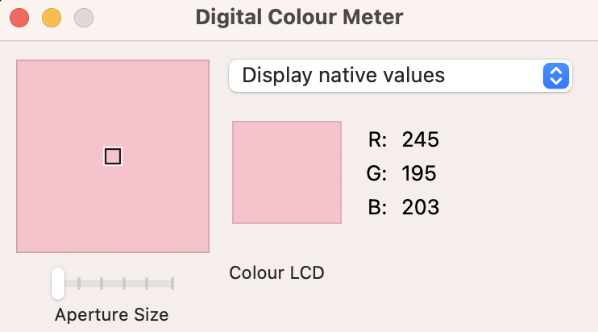

RGB (167, 133, 209)
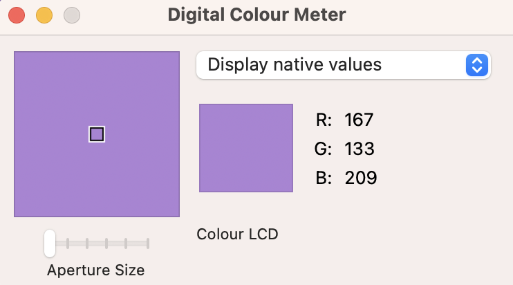

* Color used for hovering over buttons was:
rgb(202, 167, 235).
* Color used for hovering over social-media icons was:
rgb(202, 167, 235)
* Color used if user clicks the correct answer button was:
HEX #a6e775;
* Color used if user clicks incorrect answer button was:
HEX #ff7f7f;

### Typography 

I used [Google Fonts](https://fonts.google.com/) for all text. The name of the font is Bebas Neue Regular 400.
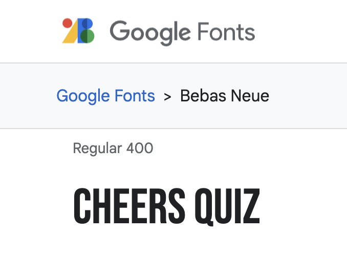

### Wireframes

#### I used [Balsamiq Wireframes](https://balsamiq.com/wireframes/) to make a mockup sketch of the layout before starting to code.
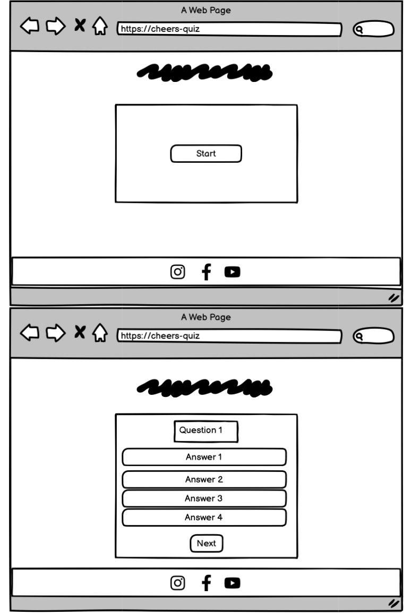

---

## Testing

### Validator testing

#### No errors were returned when passing through the official [W3C validator](https://validator.w3.org/) for the html. No errors were found when passing through the official [Jigsaw](https://jigsaw.w3.org/css-validator/validator.html.en) validator for CSS.

#### HTML
* Homepage 


* Contact-us page


* Response page


#### CSS


---

## Accessibility and performance scores
I used [lighthouse](https://developer.chrome.com/docs/lighthouse/overview/) to get approval that the site is performing well and that it is accessible.

* Home page


* Contact us page 

* Response page 

---

### Manual testing
| Test | Expected Result | Tested | Passed |
| --- | --- | --- | --- |
| Click on the start button to begin the quiz | The quiz should start and present the first question for the user to answer. | Yes | Yes |
| Answer the questions by selecting a button | If the user selects the correct answer, the chosen button should become green if it is the correct response. If the user selects an incorrect answer, the chosen button should become red. | Yes | Yes |
| Selects answers correctly | The score in the bottom of the page should be updated accordingly, displaying the total number of correct answers. | Yes | Yes |
| After answering all the questions | The quiz score should be displayed, showcasing the user's total number of correct answers out of the total number of questions. | Yes | Yes |
| The displayed score | Should be the number of correct answers provided by the user. | Yes | Yes |
| The restart button | Should take the user to question 1 | Yes | Yes |


---
## Bugs

### Solved Bug
* There was an issue with the answer buttons in the quiz. When the user picked an answer, the buttons were not disabled. This meant that the user could change their answers even after selecting one, which could lead to inaccurate score results.

* To fix this bug, I implemented a function that disables the answer buttons once the user has selected an answer.

* The bug is now solved and the user can no longer change their answer after selecting. This makes the score accurate.

### Unsolved bugs
None
### Mistakes
* I initially made a mistake of naming the functions in less descriptive ways, which could have caused confusion for other readers trying to understand the code. Once I realized this, I corrected the function names to be more clear.

--- 

## Deployment

The site was deployed to GitHub pages.
* The steps to deploy are as follows:

* In the GitHub repository, navigate to the Settings tab
From the source section drop-down menu, select the Main Branch

* Once the main branch has been selected, the page will be automatically refreshed with a detailed ribbon display to indicate the successful deployment.

## Local deployment
How to make a local clone of this project.

1. Copy this url https://github.com/bianca9901/cheers-quiz.git
2. Open terminal.
3. Type ```git clone``` and paste the url.
4. Press enter to create your local clone.

---

## Future improvements

---

## Credits
### JavaScript Quiz Tutorial
 [Web Dev Simplified](https://www.youtube.com/watch?v=riDzcEQbX6k) on Youtube has a JavaScript quiz tutorial that was great for inspiration and planning the structure of this quiz. 


### Content
The icons in the footer and logo were taken from [Font Awesome](https://fontawesome.com/)

To make the code for the box-shadow I used [Css Matic](https://www.cssmatic.com/box-shadow)

I used [Digital Color Meter](https://support.apple.com/sv-se/guide/digital-color-meter/welcome/mac) for the screenshot of the colors in my website that I demonstrated in this README.md 

---